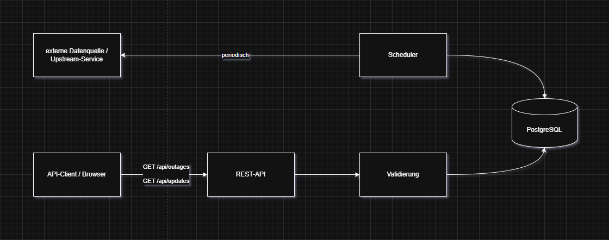

# Dashboard Backend

This repository contains the public portfolio version of my 2025 final software development project.

The application implements a backend service that periodically retrieves defined data from a simulated upstream service, persists it in PostgreSQL, and exposes it through REST endpoints for a ServiceNow Platform Analytics dashboard use case.

The public version uses JSON Server to simulate the upstream system. The project was developed and demonstrated in a local environment; no production deployment was performed.

---

## Local Development Environment

### Prerequisites

| Requirement | Version |
| ----------- | :-----: |
| Node.js     | 22 LTS  |
| Docker      | 28.4.0  |
| PostgreSQL  |   17    |
| npm         |  10.x   |

Ensure that all required components are installed and accessible via your system’s PATH before initializing the stack.

---

### Initialization

The project uses **npm** for dependency management.

To install the dependencies locally, run the following command from the repository root:

```bash
> npm install
```

---

### Environment Configuration

All configuration parameters are stored in a `.env` file located at the project root.  
A template file named `.env.example` is provided and must be copied before the first startup.

```bash
> cp .env.example .env
```

| Variable              | Description                                 |
| --------------------- | ------------------------------------------- |
| `DATABASE_URL`        | PostgreSQL connection string                |
| `SHADOW_DATABASE_URL` | Used by Prisma for schema migrations        |
| `PORT`                | Port on which the backend server listens    |
| `CRON_INTERVAL`       | Interval for scheduled data synchronization |

Do not commit the `.env` file to version control.  
Sensitive credentials such as database URLs must remain private.

---

### Running the Application

The backend runs as part of the **Docker Compose** stack.  
The source code is mounted as a **volume** for live synchronization during development.

```bash
> docker compose up
> docker logs -f dashboard_backend
```

---

### Building the Application

The backend is distributed as a **Docker container image**.  
Docker Compose automatically triggers a build when starting the stack, but manual builds are also possible.

```bash
> docker build .
```

---

## Database

```md
The backend uses **PostgreSQL 17** together with **Prisma ORM** for schema management and database access.
The database schema is defined in `prisma/schema.prisma`. Prisma Client is generated during the Docker image build, while database migrations must be applied explicitly when required.

```bash
> npx prisma migrate deploy   # Apply pending migrations
> npx prisma studio           # Open Prisma Studio
```

---

## Architecture

The diagram below illustrates the overall system architecture, showing how the scheduler, database, and API layer interact within the application.



---

## Key Components

| Component                   | Description                                                                         |
| --------------------------- | ----------------------------------------------------------------------------------- |
| **Scheduler**               | Periodically fetches and stores data from the upstream API                          |
| **API Layer (Next.js)**     | Exposes REST endpoints for ITSM data retrieval                                      |
| **Database Layer (Prisma)** | Defines models and migration logic for `ServerOutage` and `UpdateSet`               |
| **Logger**                  | Captures errors and process logs                                                    |
| **Docker Setup**            | Provides isolated and reproducible runtime environment                              |
| **Github Actions**          | Verifies Docker image builds for amd64 and arm64; no image publishing or deployment |

---

## Development Scripts

```bash
> npm run dev             # Start local development server
> npx prisma migrate deploy   # Apply latest database migrations
> npx prisma studio       # Open Prisma web interface
> npx typedoc src/lib/middleware/* src/lib/scheduler/* # Generate documentation
```

---

## Continuous Integration

The repository includes a GitHub Actions workflow for automated Docker build verification.

The workflow:

1. Checks out the repository
2. Sets up Docker Buildx
3. Builds the Docker image for `linux/amd64`

The workflow runs on pushes to `main` and on pull requests.

Image publishing is intentionally disabled (`push: false`), and no deployment step is configured. The workflow therefore verifies that the container image can be built successfully but does not publish or deploy it.

The workflow is defined in `.github/workflows/docker-build.yml`.

Automated application tests and linting are not currently part of this workflow.

---

## Logging and Error Handling

All logs, including scheduler executions, API requests, and database operations, are written to the container’s stdout and can be viewed using:

```bash
> docker compose logs
```
